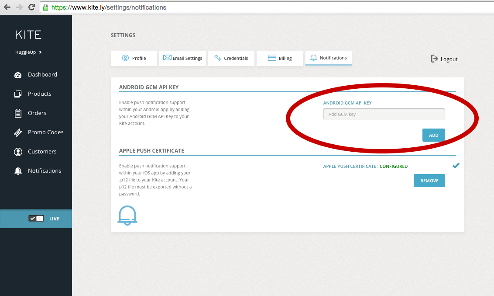

# Configuring Push Notifications

Push notifications are a powerful marketing tool that if used effectively can increase both user engagement and customer life time value by driving more sales within your application. Kite supports sending push notifications to your customers with a bit of configuration.

## Overview

In order to set up push messaging, you will need to perform the following steps:

1. Set up Google Cloud Messaging (GCM)
2. Add Kite SDK and GCM modules to your app
3. Create a push notification action

## Set up Google Cloud Messaging (GCM)

Kite push notifications on Android make use of the Google Cloud Messaging framework. It is necessary, therefore, to set up Google Cloud Messaging before adding push notifications to your app.

Log in to Google's [API Console](https://console.developers.google.com/). If you do not already have a Google account, create one now.

If you have not already created a project, click on "Create Project" to create a new one.

When you have created a project, the console's dashboard will be displayed. Make a note of the **project number** near the top of the page - this twelve-digit number will be your **Google Sender ID**, which you will need to include in your app as a string resource later.

From the Google Developer's Console dashboard, choose the **APIs** section under **APIs & auth** from the left-hand navigation menu.

In the list of APIs, look for **Google Cloud Messaging for Android**, and enable it by clicking the switch at the top of the page. Click **Credentials** under **APIs & auth**. Under the **Public API access** section, click on the **Create new Key** button to generate an **API key**. A dialog will appear that asks you which type of key you wish to generate; you should select the **Android key**.

Once you have obtained an API key, you should log in to the [Notification](https://www.kite.ly/settings/notifications) section of the Kite Dashboard and enter the key into the Android GCM API Key field.

	

